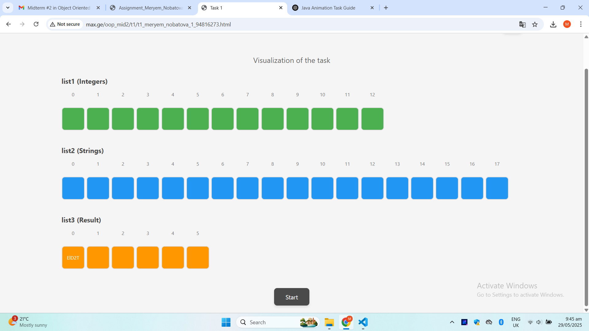

# Task 1 - Java Program: List Indexing and Sequential Removal

## Overview

This Java program processes two input lists:
- A list of integers (`list1`)
- A list of strings (`list2`)

It creates a third list (`list3`) by selecting strings from `list2` using the formula:
index = value_from_list1 * 2 - 1

If the index is within bounds, the corresponding string is added to `list3`.

After that, the program creates a new list called `result`, which is a copy of `list3`, but with elements removed sequentially from positions 0 through 6 (if they exist). This deletion simulates the behavior shown in the animation.

---

## Example

Given:
```java
list1 = [8, 4, 8, 6, 9, 4, 8, 3, 2, 8, 5, 7, 5]

list2 = [
  "6G3", "TNWh", "fWXW", "temd", "3bW", "RJEO", "WTmn", "EID2T", "EAQo", "3hXKz",
  "elUPN", "2av", "PQ86t", "N1v", "6H3r", "MgA", "jMCAg", "UYT"
]

the output will be:
list3:
[MgA, EID2T, MgA, 2av, UYT, EID2T, MgA, RJEO, temd, MgA, 3hXKz, N1v, 3hXKz]
result:
[EID2T, 2av, EID2T, RJEO, MgA, N1v]

```md

---

the screenshot:


---

## Author

**Meryem Nobatova**
